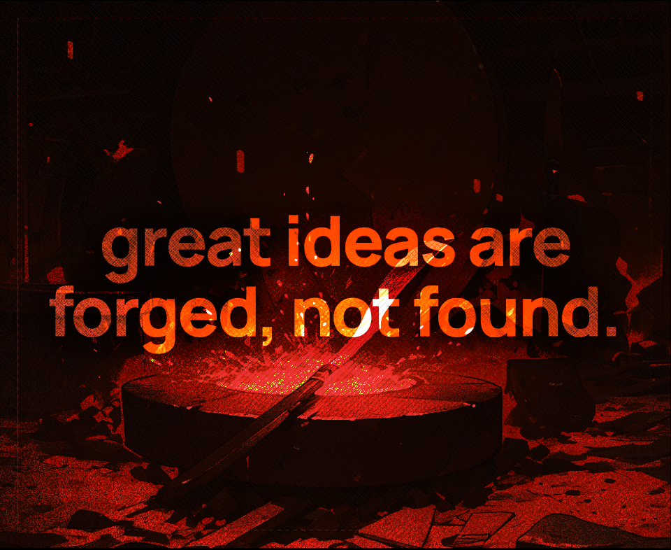

# 💡 the idea of ideas

#### ideas, not plans

* ideas ain't no plan
* they are a thought
* that will evolve like a pokemon
* evolve and grow better and stronger every iteration

#### the story of ideas

* ideas start out as thoughts
* no one has idea how they go out
* in the case of farza, first built a productivity app called farzalog
* then a school for kids
* finally end up building buildspace
* so you do not start with the thing, you make the thing with what you started

#### "great ideas are forged not found"

<figure><figcaption></figcaption></figure>

* pick an idea and iterate
* until u finally reach the ["tower of god"](#user-content-fn-1)[^1]
* progress is not linear, you grow as long as you move

<figure><figcaption>
the iterator always wins.
</figcaption></figure>

#### tldr

* ideas are starting points, they may pivot as you do deep into them
* work on something you are passionate about to give your project a heart 🫶🏻
* precisely explain your thing such that it can be understood super easily by anyone

#### source

if you wanna know the source of these notes, these are from the s4 w1 lecture

* [slides](https://www.figma.com/proto/e4gMeyrdXO5qq0PBHnGEuW/s4-lecture-%231----ideas-are-forged%2C-not-found.?type=design\&node-id=3450-554\&t=cmV2q6XG2NofiCkY-1\&scaling=contain\&page-id=3450%3A553\&mode=design)
* [stream](https://www.twitch.tv/videos/1893531250?t=00h08m34s)

####

[^1]: reference to the anime named "tower of god", means reach your goal, gain the answer to everything
