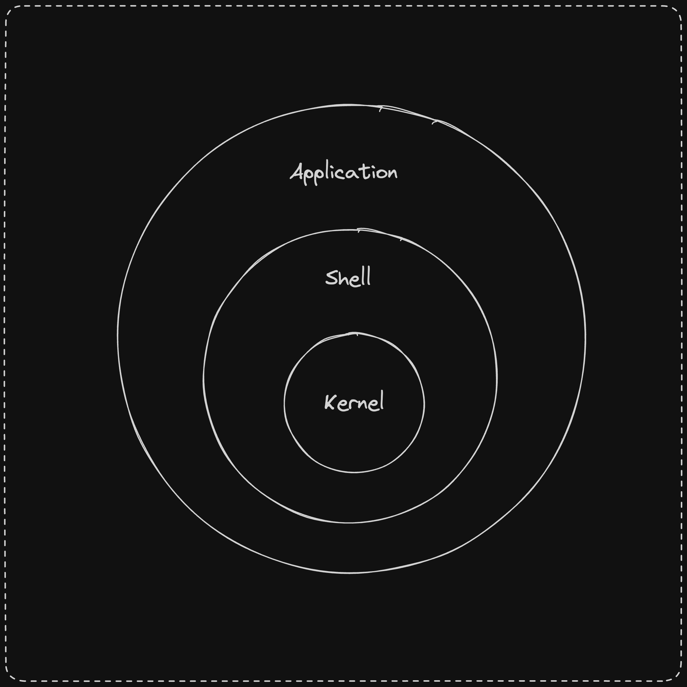

# 📖 Introduction

## What is Linux Kernel?

Linux is a **kernel**. A kernel is a program that manages hardware resources for the user. It connects the operating system to the hardware.

<figure><figcaption></figcaption></figure>

## What is GNU?

GNU packages are the core of the GNU operating system. GNU stands for GNU's Not Unix. It is a Unix-like operating system. It is free software—everyone can use it and redistribute it.

## What is GNU/Linux?

GNU/Linux is when GNU ang Linux hold hands! Together they form a complete operating system. In the rest of the notes, we will refer to it as simply Linux.

## What is a Distribution? (distro)

A Linux distribution is an packaged version of GNU/Linux. It also has additional software like package managers, desktop environments, etc.

There are many distributions of Linux. Some of the most popular ones are **Ubuntu**, Debian, **Fedora**, Arch Linux, etc.

## What is a Shell?

Shell is a program that takes commands and passes them to the operating system to execute.

## What is a Desktop Environment?

It is the graphical user interface (GUI) of an operating system.

Some of the most popular desktop environments are GNOME, KDE, Xfce, etc.

## What is a Package Manager?

It allows to install, update, remove and manage software packages.

Some of the most popular package managers are **apt**, **dnf**, **pacman**, etc.
